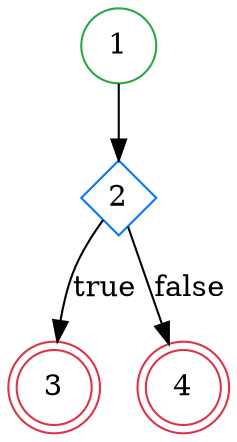

# Plugin Eclipse Capivara - Versão Final Corrigida

## 🎯 Sobre o Plugin

O **Capivara** é um plugin para Eclipse IDE que analisa código Java selecionado e gera:

1. **Enumeração de Nós** - Mapeia cada linha de código para seu nó correspondente no grafo de fluxo de controle
2. **Tabela Verdade** - Gera tabela verdade completa para todas as condições do método
3. **Grafo Causa-Efeito (DOT)** - Produz código DOT para visualização do grafo de fluxo de controle

## ✅ Correções Implementadas

### Enumeração de Nós:
- ✅ **Numeração Sequencial:** Nós numerados de forma contínua (1, 2, 3, 4...)
- ✅ **Mapeamento Correto de Chaves:** `}` mapeadas para o nó do bloco correspondente
- ✅ **Mapeamento Correto do `else`:** Palavra-chave `else` mapeada para seu nó específico
- ✅ **Tratamento de `else { if (...) }`:** Estruturas aninhadas tratadas corretamente
- ✅ **Conexão de Nós de Retorno:** `return` statements conectados adequadamente

### Tabela Verdade:
- ✅ **Condições Atômicas:** Extração precisa de condições de expressões complexas
- ✅ **Ordem Correta:** Condições listadas na ordem de aparição no código
- ✅ **Avaliação Precisa:** Combinações V/F mapeadas corretamente para seus efeitos
- ✅ **Condições Múltiplas:** Tratamento adequado de `&&`, `||` e expressões aninhadas

### Grafo DOT:
- ✅ **Nós EXIT Vermelhos:** Nós de `return` destacados em vermelho
- ✅ **Labels "false":** Arestas `false` rotuladas explicitamente
- ✅ **Cores Diferenciadas:** ENTRY (verde), DECISION (azul), PROCESSING (preto), EXIT (vermelho)
- ✅ **Formas Diferenciadas:** Círculos, diamantes e círculos duplos para diferentes tipos de nós

### Interface:
- ✅ **Botão de Copiar:** Copia código DOT para área de transferência
- ✅ **Abas Organizadas:** Resultados separados em abas para melhor visualização
- ✅ **Mensagens de Status:** Feedback visual das operações

## 🚀 Como Usar

1. **Instalação:**
   - Importe o projeto no Eclipse como plugin
   - Execute como "Eclipse Application" para testar

2. **Uso:**
   - Selecione um método Java no editor
   - Clique com botão direito → "Analisar Código para Testes"
   - Visualize os resultados na view "Análise Capivara"

3. **Visualização do Grafo:**
   - Copie o código DOT da aba "Grafo Causa-Efeito (DOT)"
   - Use ferramentas como Graphviz Online, Viz.js ou Graphviz local para visualizar

## 📁 Estrutura do Projeto

```
capivara_plugin_final/
├── META-INF/
│   └── MANIFEST.MF
├── src/br/ufjf/capivara/
│   ├── Activator.java
│   ├── analyzer/
│   │   ├── CauseEffectVisitor.java
│   │   ├── CodeAnalyzer.java
│   │   └── ConditionExtractor.java
│   ├── handlers/
│   │   └── AnalyzeCodeHandler.java
│   ├── views/
│   │   └── AnalysisResultView.java
│   ├── graph/
│   │   └── GraphvizGenerator.java
│   ├── table/
│   │   └── TruthTableGenerator.java
│   └── model/
│       ├── Edge.java
│       └── PathCondition.java
├── icons/
│   └── logo.svg
├── plugin.xml
├── build.properties
└── README.md
```

## 🔧 Requisitos

- Eclipse IDE 2021-03 ou superior
- Java 17 ou superior
- JDT (Java Development Tools)

## 📝 Exemplos de Saída

### Enumeração de Nós:
```
/*Linha 01*/ /*Nó 01*/ public int exemplo(int a) {
/*Linha 02*/ /*Nó 02*/     if (a > 0) {
/*Linha 03*/ /*Nó 03*/         return a * 2;
/*Linha 04*/ /*Nó 02*/     } else {
/*Linha 05*/ /*Nó 04*/         return 0;
/*Linha 06*/ /*Nó 02*/     }
/*Linha 07*/ /*Nó 01*/ }
```

### Tabela Verdade:
```
Caso | a > 0               | Resultado (Efeito)       
---------------------------------------------------------
1    | F                   | 0                        
2    | V                   | a * 2                    
```

### Grafo DOT:


## 🎨 Visualização Recomendada

Para visualizar os grafos DOT gerados:

1. **Online:** [Graphviz Online](http://magjac.com/graphviz-visual-editor/)
2. **Local:** Instale Graphviz e use: `dot -Tpng grafo.dot -o grafo.png`
3. **VS Code:** Extensão "Graphviz (dot) language support for Visual Studio Code"

## 📞 Suporte

Para dúvidas ou problemas, consulte a documentação do Eclipse Plugin Development ou entre em contato com a equipe de desenvolvimento.

---

**Versão:** 1.0.0  
**Desenvolvido por:** UFJF  
**Licença:** Eclipse Public License

