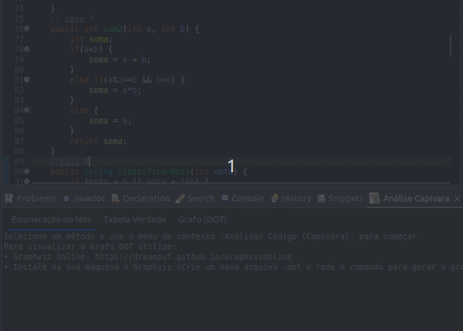
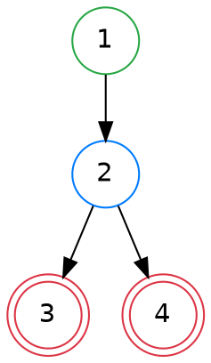

<p align="center">
  
</p>

<h1 align="center">
  Capivara - Análise de Fluxo de Controle para Eclipse
</h1>

<p align="center">
  Um plugin para a IDE Eclipse que analisa métodos Java para gerar Grafos de Fluxo de Controle e Tabelas Verdade, auxiliando na criação e visualização de casos de teste.
  <br />
  <br />
  
  
</p>

---

## Sumário


* [O que o Plugin Faz?](#o-que-o-plugin-faz)
* [Instalação](#instalação)
* [Como Usar](#como-usar)
* [Exemplo de Análise](#exemplo-de-análise)
* [Entendendo o Grafo: Legenda dos Nós](#entendendo-o-grafo-legenda-dos-nós)
* [Detalhes Técnicos](#detalhes-técnicos)


## O que o Plugin Faz? 

O **Capivara** é uma ferramenta de análise estática integrada à IDE Eclipse, projetada para auxiliar desenvolvedores e testadores a entender a lógica de seus métodos Java. Com um clique, ele gera três artefatos principais:

1.  **Enumeração de Nós:** Mapeia cada linha de código para seu nó correspondente no grafo.
2.  **Tabela Verdade:** Cria uma tabela de causa-efeito completa para todas as condições do método. (2<sup>n</sup>)
3.  **Grafo de Fluxo de Controle:** Produz o código-fonte em formato DOT, pronto para ser visualizado.

## Instalação

### Método 1: Pelo Eclipse (Recomendado)

1.  No Eclipse, vá em `Help` > `Install New Software...`
2.  Clique em `Add...` e, no campo "Location", adicione a seguinte URL do nosso Update Site:
    > `https://eduardonascimentojf.github.io/capivara-plugin/`
3.  Selecione "Capivara" na lista, avance e conclua a instalação.

### Método 2: Instalação Manual (via Dropins)

1.  Baixe o arquivo `.jar` mais recente na nossa [página de Releases](https://github.com/eduardonascimentojf/capivara-plugin/releases).
2.  Copie o arquivo para a pasta `dropins` dentro do diretório de instalação do seu Eclipse e reinicie.

## Como Usar

1.  No eclipse, **selecione o código de um método completo**.
2.  Clique com o **botão direito** na seleção.
3.  No menu de contexto, escolha a opção **"Analisar Código para Testes"**.
4.  A view "Análise Capivara" abrirá com os resultados.

</br>




## Exemplo de Análise

**Código de Entrada:**

```java
public int exemplo(int a) {
    if (a > 0) {
        return a * 2;
    } else {
        return 0;
    }
}
```

**Resultados Gerados:**

<details>
<summary><strong>1. Enumeração de Nós</strong></summary>

```java
/*Linha 01*/ /*Nó 01*/ 		public int exemplo(int a) {
/*Linha 02*/ /*Nó 02*/ 		    if (a > 0) {
/*Linha 03*/ /*Nó 03*/ 		        return a * 2;
/*Linha 04*/ /*Nó 01*/ 		    } else {
/*Linha 05*/ /*Nó 04*/ 		        return 0;
/*Linha 06*/ /*Nó 01*/ 		    }
/*Linha 07*/ /*Nó 01*/ 		}

```

</details>

<details>
<summary><strong>2. Tabela Verdade</strong></summary>

```
Caso | a > 0                     | Resultado (Efeito)       
------------------------------------------------------------
1    | F                         | 0                        
2    | V                         | a * 2                    

```
</details>

<details>
<summary><strong>3. Grafo (Código DOT)</strong></summary>



</details>

</br>

> ⚠️ **Atenção:**
> Para visualizar o grafo gerado você pode:
>
> * Instalar o **Graphviz** na sua máquina (modo local).
> * Ou usar a versão online disponível em: [GraphvizOnline](https://dreampuf.github.io/GraphvizOnline)


## Entendendo o Grafo: Legenda dos Nós

O grafo gerado utiliza cores e formas para diferenciar o papel de cada nó no fluxo de controle do seu método.


| Tipo de Nó | Descrição |
| :--- | :--- |
| **ENTRY** (Verde) | O ponto de início do método. |
| **PROCESSING** (Preto) | Um ou mais comandos sequenciais. |
| **DECISION** (Azul) | Uma estrutura condicional, como `if`. |
| **LOOP DECISION** (Laranja)| Uma estrutura de laço, como `while` ou `for`. |
| **EXIT** (Vermelho, Círculo Duplo) | Um ponto de término do fluxo, como `return`. |


## Detalhes Técnicos

* **Versão Atual:** 1.0.0 (Alpha)
* **Plataforma Suportada:** Eclipse IDE 2021-03 ou superior
* **Requisitos:** Java 17 ou superior

