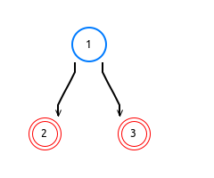
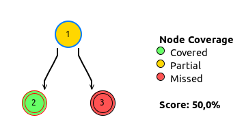
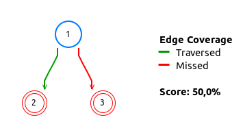

<p align="center">
  
</p>

<h1 align="center">
  Capivara - Análise de Fluxo de Controle para Eclipse
</h1>

<p align="center">
  Um plugin para a IDE Eclipse que analisa métodos Java para gerar Grafos de Fluxo de Controle e realizar análise de cobertura de testes estruturais, auxiliando na criação e visualização de casos de teste.
  <br />
  <br />
  
  
  
</p>

---

## Sumário

* [O que o Plugin Faz?](#o-que-o-plugin-faz)
* [Instalação](#instalação)
* [Como Usar](#como-usar)
* [Exemplo de Análise](#exemplo-de-análise)
* [Entendendo o Grafo: Legenda dos Nós](#entendendo-o-grafo-legenda-dos-nós)
* [Contexto Acadêmico e Contribuição](#contexto-acadêmico-e-contribuição)
* [Detalhes Técnicos](#detalhes-técnicos)

---

## O que o Plugin Faz?

O **Capivara** é uma ferramenta de análise estática integrada à IDE Eclipse, projetada para auxiliar desenvolvedores e estudantes a compreenderem a lógica e a complexidade estrutural de seus métodos Java. A partir do código-fonte, ele gera três artefatos principais:

1. **Enumeração de Nós:** Mapeia de forma textual as linhas de comando do método aos nós abstratos do fluxo.
2. **Grafo de Fluxo de Controle (GFC):** Cria um diagrama visual e interativo do fluxo logístico da rotina de forma integrada à IDE.
3. **Análise de Cobertura de Testes:** Integra dados de execução real (via EclEmma) para colorir o grafo, destacando caminhos cobertos e lacunas de teste através de critérios de nós e arestas.

---

## Instalação

### Método Único: Update Site (Recomendado e Obrigatório)

Devido à transição para uma estrutura modular e à necessidade de dependências gráficas específicas (GMF, EMF e ELK), o processo de instalação deve ser feito exclusivamente através do mecanismo de atualização do Eclipse para garantir que todas as extensões de modelagem sejam resolvidas automaticamente.

1. No Eclipse, acesse o menu superior **Help > Install New Software...**
2. Clique no botão **Add...** no canto superior direito.
3. No campo *Location*, insira a URL estável do repositório:
   > `https://eduardonascimentojf.github.io/capivara-plugin/`
4. Selecione a categoria **Capivara Tools** (ou o plugin correspondente listado), avance com as confirmações de segurança do Eclipse e conclua o processo.
5. Reinicie a IDE para efetivar a carga dos módulos.

> **Nota de Suporte:** O método de instalação manual por injeção direta de arquivos JAR na pasta `dropins` foi descontinuado e não é válido para esta versão. A falta de resolução ativa das dependências do framework gráfico pelo `dropins` impede a ativação do ecossistema do plugin.

---

## Como Usar

O plugin adiciona novas opções ao menu de contexto do editor de texto Java. As ações respondem de maneira distinta dependendo de como o escopo é selecionado no editor para o parser da AST:

* **Para a Enumeração de Nós:** O mecanismo é flexível. Basta que o método alvo esteja contido em qualquer ponto dentro da área selecionada.
* **Para a Geração do GFC e Análise de Cobertura:** Para evitar erros de captura sintática no parser, recomenda-se selecionar **apenas a assinatura (nome do método)**; o Eclipse mapeará o bloco interno de forma automatizada. Caso opte por selecionar o bloco manualmente, o início da seleção deve ser o exato início do método e o término no fechamento de sua última chave, sem espaços órfãos ou comentários externos antes ou depois.

### Menu de Opções do Capivara

| Opção | Descrição |
| :--- | :--- |
| **Node Enumeration** | Realiza o mapeamento lógico e exibe a associação das linhas do método em uma aba integrada dedicada (Show View). |
| **Generate GFC** | Cria o arquivo de modelo gráfico interativo. Permite arrastar nós, arestas e inspecionar detalhes logísticos posicionando o ponteiro sobre as estruturas (Tooltips). |
| **Coverage Analysis GFC** | Exige a execução prévia da suíte de testes (JUnit) via botão de cobertura do EclEmma. Permite aplicar critérios de *Node Coverage* (nós visitados) ou *Edge Coverage* (decisões tomadas) para colorização do fluxo. |

---

## Exemplo de Análise

**Código de Entrada:**

```java
public int exemplo(int a) {
    if (a > 0) {
        return a * 2;
    } else {
        return 0;
    }
}

```

### 1. Enumeração de Nós

```java
/*Line 01*/ /*Node 01*/ 	 public int exemplo(int a) {
/*Line 02*/ /*Node 01*/ 	        if (a > 0) {
/*Line 03*/ /*Node 02*/ 	            return a * 2;
/*Line 04*/ /*Node 03*/ 	        } else {
/*Line 05*/ /*Node 03*/ 	            return 0;
/*Line 06*/ /*Node 03*/ 	        }
/*Line 07*/ /*Node 01*/ 	    }
```

### 2. Grafo de Fluxo de Controle (GFC)
Diagrama estrutural gerado automaticamente que ilustra as ramificações e caminhos possíveis da rotina:




### 3. Análise de Cobertura de Testes (Coverage)

Para realizar a plotagem das cores no fluxo, toma-se como base a execução do seguinte teste:

```java
@Test
public void testExemploCaminhoPositivo() {
    int resultado = exemplo(5);
    assertEquals(10, resultado);
}
```

#### A. Cobertura de Nós (Node Coverage)




#### B. Cobertura de Arestas (Edge Coverage)





## Entendendo o Grafo: Legenda dos Nós

O diagrama visual utiliza o padrão de formas e cores mapeado pelo framework para categorizar as estruturas sintáticas da linguagem Java:

| Tipo de Nó | Função no Fluxo de Controle |
| :--- | :--- |
| **PROCESSING** | Um ou mais comandos sequenciais e atribuições de bloco. |
| **DECISION** | Estrutura condicional de desvio lógico (ex: comandos `if`). |
| **LOOP DECISION** | Estrutura de repetição e controle de laço (ex: `while`, `for`). |
| **SWITCH** | Ponto de partida de uma estrutura de seleção múltipla (`switch`). |
| **CASE** | Ramo condicional específico associado a uma escolha do `switch`. |
| **EXIT** | Ponto de término ou interrupção do método (ex: comandos `return`). |


---

### Mapeamento de Cores de Cobertura

Ao realizar a análise de cobertura estrutural em conjunto com o EclEmma, os elementos gráficos assumem cores específicas que denotam o status de execução dos testes. Essa colorização responde de duas formas distintas com base no critério selecionado:

#### 1. Cobertura de Nós (Node Coverage)
Modifica as cores de preenchimento dos nós para indicar quais blocos de comandos foram alcançados:

* **Covered (Verde):** Elementos que foram totalmente visitados e validados pelo fluxo de execução dos testes.
* **Partial (Amarelo):** Estruturas lógicas ou ramificações que foram executadas apenas parcialmente (ex: uma condicional onde apenas o lado Verdadeiro ou Falso foi exercitado).
* **Missed (Vermelho):** Linhas de comando, blocos ou desvios que não foram alcançados por nenhum caso de teste da suíte atual.


#### 2. Cobertura de Arestas (Edge Coverage)
Modifica as cores das arestas para indicar quais caminhos e decisões lógicas foram efetivamente percorridos.

* **Traversed (Verde):** O fluxo de decisão foi percorrido pelo teste.
* **Missed (Vermelho):** O caminho não foi testado por nenhuma rotina executada.

---

### Comportamento de Layout (ELK & Graphviz)

O posicionamento automático e a distribuição dos elementos no diagrama gráfico utilizam a tecnologia do ELK (Eclipse Layout Kernel):

* Se o utilitário **Graphviz** estiver instalado no sistema operacional e configurado no path, o plugin utilizará nativamente o algoritmo DOT, entregando uma distribuição visual e alinhamento otimizados.
* Caso o Graphviz não seja encontrado, o sistema acionará automaticamente o motor de distribuição padrão do ELK.
* Em determinados ambientes, pode ocorrer um delay para a aplicação inicial do layout. Caso os nós apareçam desalinhados ou sobrepostos na primeira carga, basta acionar a rotina de geração do grafo novamente para reajustar a árvore de distribuição.


## Contexto Acadêmico e Contribuição

Este plugin foi originalmente idealizado e desenvolvido como parte de um projeto de conclusão de curso (Trabalho de Conclusão de Curso - TCC) na faculdade. O principal propósito da ferramenta é servir de apoio didático no meio acadêmico, facilitando o ensino-aprendizagem de Testes Estruturais de Software.

Por ser um projeto puramente de cunho educacional e científico, o ecossistema foi publicado sob a licença open-source MIT para encorajar que novos estudantes, pesquisadores e entusiastas da área da computação façam forks do projeto, utilizem a ferramenta em suas pesquisas e evoluam a arquitetura do plugin continuamente. Sinta-se convidado a submeter Pull Requests!

## Detalhes Técnicos

* **Versão Atual:** 1.2.0

* **Plataforma Suportada:** Eclipse IDE 2024-03 ou superior (com suporte a JVM moderna)
* **Requisitos do Ambiente:** Java 17 ou superior configurado na IDE
